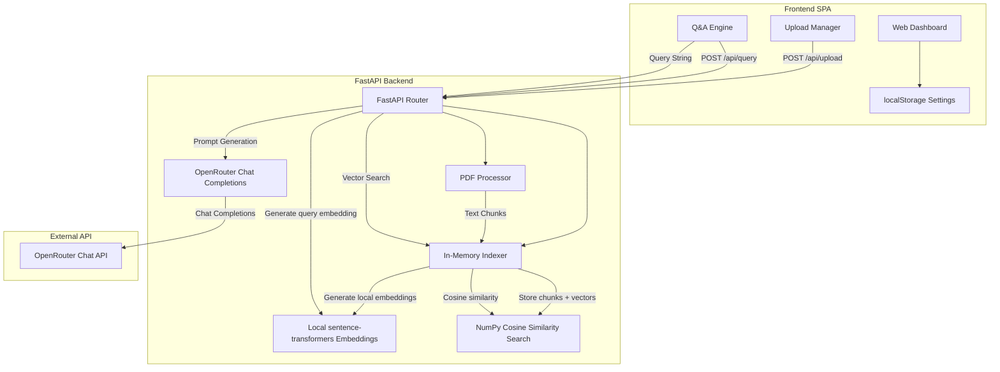

# Architectural Documentation - PDF Q&A Navigator

This document outlines the architecture, key components, and data flows of the PDF Q&A Tool developed for Innovate Insights.

---

## 1. System Overview
The PDF Q&A Navigator is a full-stack, single-user session-oriented application designed to ingest PDF documents, parse and index their text content using vector embeddings, and support natural language question-answering with precise page citations.

The tool consists of two primary parts:
1. **Frontend**: A modern, single-page application (SPA) built using HTML5, Vanilla CSS, and Vanilla JavaScript.
2. **Backend**: A Python web server powered by FastAPI, utilizing PyPDF for extraction, sentence-transformers for local embeddings, NumPy for cosine similarity search, and OpenRouter for chat completions.

---

## 2. Component Diagram

---

## 3. Key Components

### 3.1. Frontend Dashboard (Client-side)
- **User Interface**: Designed with glassmorphism aesthetics, incorporating responsive panels for uploading documents and conducting conversations.
- **Session Manager (`app.js`)**: Assigns a unique, random session ID to the browser and saves it in `localStorage` to distinguish context across multiple browser tabs or sessions.
- **Credential Storage**: Saves the user-supplied OpenRouter API Key and model preferences inside browser `localStorage`.
- **Upload Manager**: Manages drag-and-drop actions, reads PDF files as binaries, and uploads them to the server using the current browser session ID.
- **Q&A Chat Interface**: Captures query text, presents conversational message feeds with animated skeleton loaders, and renders answers with citations.
- **Programmatic DOM Protection**: Programmatically generates HTML nodes instead of string interpolation inside `.innerHTML` to defend against DOM Cross-Site Scripting (DOMXSS).

### 3.2. Web API Routing (`backend/main.py`)
- **FastAPI Core**: Serves JSON API routes and mounts the static `frontend/` directory to run both frontend and backend under a single host.
- **CORS Middleware**: Allows cross-origin requests for decoupled frontend development environments.
- **Robust Exception Middleware**: Catches PDF read failures, OpenRouter connection errors, and missing credentials to return detailed, structured error messages to the client.

### 3.3. Document Pipeline (`backend/pdf_processor.py`)
- **PyPDF Extractor**: Extracts text page-by-page from binary stream buffers.
- **Semantic Text Chunker**: Normalizes whitespaces, and splits text into chunks of 1,000 characters with a 200-character overlap. Splits are calculated at sentence boundaries (punctuation) where possible, falling back to word spacing, to preserve semantic meaning.

### 3.4. Session Vector Indexer (`backend/indexer.py`)
- **In-Memory Store**: Retains extracted text chunks alongside their metadata (filename, page number) and 384-dimensional floating-point embedding vectors in a global dictionary keyed by `session_id`.
- **Cosine Similarity Engine**: Utilizes NumPy vectorization to calculate the cosine similarity between the query embedding and the indexed chunk embeddings. Computes dot products and vector norms in microseconds.

### 3.5. LLM Client Service (`backend/llm_service.py`)
- **Embedding Generation**: Uses the local `all-MiniLM-L6-v2` sentence-transformers model to generate embeddings for uploaded chunks and user queries, with no API key required for indexing.
- **RAG Chat completions**: Builds a system prompt instructing the model to ground its response strictly in the retrieved snippets, and calls the OpenRouter chat endpoint (`google/gemini-2.5-flash` by default).

---

## 4. Main Data Flows

### 4.1. Document Ingestion Flow
1. User drops PDF files into the upload zone.
2. The frontend sends a multipart request to `POST /api/upload` containing the files and the session ID; the API key header is accepted but not used during this step.
3. The backend extracts the text from each page of the PDFs.
4. The backend chunks the extracted text while attaching page-level metadata.
5. The backend generates local embeddings for all chunks using the sentence-transformers model cached on the machine.
6. The backend indexes the chunks and embeddings under the active session ID.
7. The status statistics (total documents, chunks) are returned to update the frontend.

### 4.2. Query and Retrieval Flow (RAG)
1. User inputs a natural language question (e.g. *"What is our projected Q4 growth?"*) and presses Enter.
2. The frontend sends a request to `POST /api/query` with the question, session ID, and API key.
3. The backend generates a local embedding vector for the question using the same sentence-transformers model.
4. The backend performs cosine similarity using NumPy between the query vector and all chunk vectors in the session.
5. The top 5 matching text chunks are selected as context.
6. The backend builds a prompt merging the context and the question, then sends it to OpenRouter chat completions.
7. The model generates a grounded response citing document names and page numbers.
8. The backend returns the answer and the sources metadata to the frontend.
9. The frontend renders the markdown answer and appends an interactive, collapsible source citation accordion.
